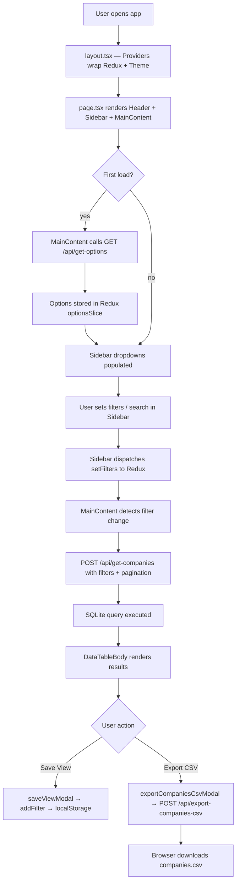
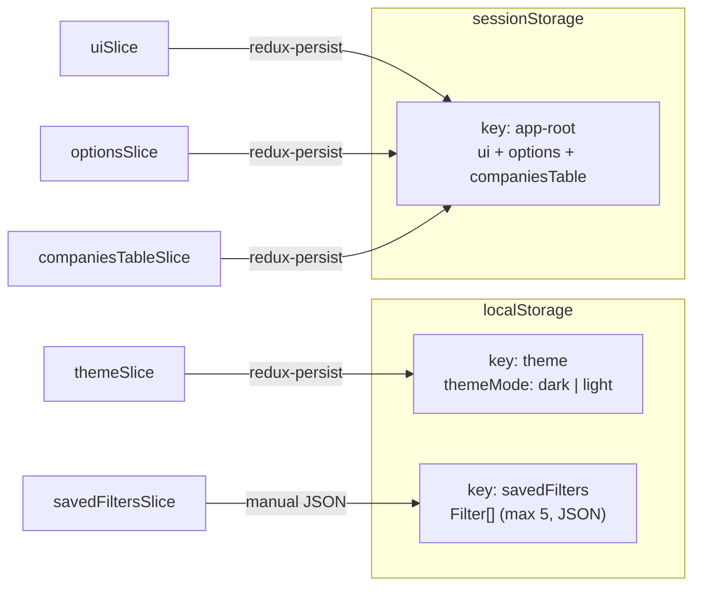

# Companies Dashboard

A full-stack Next.js dashboard for searching, filtering, and exporting company data by technology stack, location, and category.

---

## Quick Start

> **Requires:** Node.js >= 22

```bash
npm install          # install dependencies
npm run setup        # seed the SQLite database
npm run dev          # start dev server → http://localhost:3000
```

```bash
npm run build        # production build
npm run start        # production server
npm run lint         # biome check
npm run format       # biome format --write
```

---

## Tech Stack

| Layer | Technology | Version |
|---|---|---|
| Framework | Next.js (App Router) | 15.5.0 |
| UI | React | 19.1.0 |
| Component Library | MUI (Material UI) | 6.5.0 |
| Icons | MUI Icons + react-icons | 6.5.0 / 5.6.0 |
| Styling | Tailwind CSS | 4.x |
| State Management | Redux Toolkit + react-redux | 2.11.2 / 9.2.0 |
| State Persistence | redux-persist | 6.0.0 |
| Database | SQLite via better-sqlite3 | 12.6.2 |
| Logging | Winston | 3.19.0 |
| JSON parsing | JSON5 | 2.2.3 |
| Language | TypeScript | 5.x |
| Linter/Formatter | Biome | 2.2.0 |

**HTTP client:** Native `fetch` (no axios)

---

## Application Flow



---

## Folder Structure

```
src/
├── app/
│   ├── layout.tsx              # Root layout — wraps with <Providers>
│   ├── page.tsx                # Main page (client component)
│   └── api/
│       ├── get-options/        # GET  /api/get-options
│       ├── get-companies/      # POST /api/get-companies
│       └── export-companies-csv/ # POST /api/export-companies-csv
├── components/
│   ├── Providers.tsx           # Redux store + MUI theme provider
│   ├── Header.tsx              # Top app bar
│   ├── Sidebar.tsx             # Filter panel (drawer)
│   ├── MainContent.tsx         # Data table area + modals
│   ├── companyTable.config.tsx # Column definitions & cell renderers
│   ├── companiesSearchBar.tsx  # Search input wrapper
│   ├── saveViewModal.tsx       # Save filter set modal
│   ├── exportCompaniesCsvModal.tsx # CSV export modal
│   ├── table/
│   │   ├── dataTableBody.tsx   # MUI Table with pagination
│   │   └── staticNoData.tsx    # Empty state display
│   ├── autocomplete/
│   │   └── multiselect.tsx     # Multi-select filter input
│   ├── slider/
│   │   └── rangeSlider.tsx     # Min/max tech count slider
│   ├── chips/
│   │   └── customChip.tsx      # Styled MUI chip
│   ├── searchbar/
│   │   └── searchbar.tsx       # Search input component
│   └── flags/
│       └── flagIcon.tsx        # Country flag icons
├── store/
│   ├── store.ts                # Redux store + persist config
│   ├── slices/
│   │   ├── uiSlice.ts          # Sidebar open/close
│   │   ├── themeSlice.ts       # Dark / light mode
│   │   ├── optionsSlice.ts     # Filter dropdown options
│   │   ├── companiesTableSlice.ts # Active filters + pagination
│   │   └── savedFiltersSlice.ts   # Saved filter sets
│   └── storage/
│       ├── createLocalStorage.ts
│       ├── createSessionStorage.ts
│       └── noopStorage.ts      # SSR-safe no-op
├── lib/
│   ├── db.ts                   # SQLite singleton connection
│   ├── logger.ts               # Winston logger
│   └── theme.ts                # MUI theme factory (dark + light)
├── hooks/
│   └── useIsMobileScreen.ts
├── constants.ts
├── setup.ts                    # DB seed script (npm run setup)
└── sample-data/
    ├── metaData.sample.json    # Company metadata (NDJSON, UTF-16LE)
    ├── techData.sample.json    # Domain → tech list (NDJSON, UTF-16LE)
    └── techIndex.sample.json   # Tech name → category mapping
```

---

## State Management (Redux)

### Redux Slices

| Slice | State fields | Persisted to |
|---|---|---|
| `ui` | `sidebarOpen: boolean` | sessionStorage |
| `theme` | `themeMode: "dark" \| "light"` | localStorage |
| `options` | `optionsData`, `optionsLoading`, `optionsError` | sessionStorage |
| `companiesTable` | `filters`, `pagination`, `fetchDataLoading` | sessionStorage |
| `savedFilters` | `Filter[]` (max 5) | localStorage (manual) |

### `companiesTable` — filters shape

| Field | Type | Default |
|---|---|---|
| `searchStr` | `string` | `""` |
| `countries` | `string[]` | `[]` |
| `companyCategories` | `string[]` | `[]` |
| `includedTechList` | `string[]` | `[]` |
| `excludedTechList` | `string[]` | `[]` |
| `includedTechCategoryList` | `string[]` | `[]` |
| `excludedTechCategoryList` | `string[]` | `[]` |
| `minNumberOfTech` | `number` | `0` |
| `maxNumberOfTech` | `number` | `0` |

### `companiesTable` — pagination shape

| Field | Type | Default |
|---|---|---|
| `page` | `number` | `0` |
| `rowsPerPage` | `number` | `5` |
| `totalRecords` | `number` | `0` |

---

## Storage Mapping



| Storage | Key | Contents | Why |
|---|---|---|---|
| `localStorage` | `theme` | Dark/light preference | Survives tab close — user preference |
| `localStorage` | `savedFilters` | Saved filter configs (max 5) | User-created, should persist across sessions |
| `sessionStorage` | `app-root` | ui + options + companiesTable | Resets on tab close — no stale filter state |

---

## Database (SQLite)

**File:** `companies.db` (project root, created by `npm run setup`)

**Connection:** Singleton via `src/lib/db.ts` — opened once and reused.

### Table: `companies`

| Column | Type | Constraints |
|---|---|---|
| `domain` | `TEXT` | `NOT NULL`, part of PK |
| `companyName` | `TEXT` | nullable |
| `companyCategory` | `TEXT` | nullable |
| `city` | `TEXT` | nullable |
| `state` | `TEXT` | nullable |
| `country` | `TEXT` | nullable |
| `zipcode` | `TEXT` | nullable |
| `tech` | `TEXT` | nullable, part of PK |
| `techCategory` | `TEXT` | nullable |

**Primary Key:** `(domain, tech)` — one row per domain–technology combination.

**Indexes:** `companyCategory`, `country`, `tech`, `techCategory`

### Sample row

```json
{
  "domain": "acme.com",
  "companyName": "Acme Corp",
  "companyCategory": "SaaS",
  "city": "San Francisco",
  "state": "CA",
  "country": "US",
  "zipcode": "94105",
  "tech": "React",
  "techCategory": "JavaScript Frameworks"
}
```

### Seed data sources

| File | Encoding | Description |
|---|---|---|
| `metaData.sample.json` | UTF-16LE NDJSON | Domain, company name, city, state, country, zip, category |
| `techData.sample.json` | UTF-16LE NDJSON | Domain → array of technology names |
| `techIndex.sample.json` | UTF-8 JSON | Tech name → tech category mapping |

---

## APIs

### 1. `GET /api/get-options`

Fetches all distinct filter option values and the max tech count.

**Response**

```json
{
  "maxTechsInDomain": 42,
  "companyCategoryOptions": ["SaaS", "eCommerce"],
  "countryOptions": ["US", "IN", "GB"],
  "techOptions": ["React", "PostgreSQL"],
  "techCategoryOptions": ["JavaScript Frameworks", "Databases"]
}
```

**curl**

```bash
curl http://localhost:3000/api/get-options
```

---

### 2. `POST /api/get-companies`

Searches and paginates companies with optional filters.

**Request body** (all fields optional)

| Field | Type | Notes |
|---|---|---|
| `searchStr` | `string` | Substring match on `domain` + `companyName`; max 100 chars |
| `countries` | `string[]` | Non-empty array if provided |
| `companyCategories` | `string[]` | Non-empty array if provided |
| `includedTechList` | `string[]` | Must not overlap with `excludedTechList` |
| `excludedTechList` | `string[]` | Must not overlap with `includedTechList` |
| `includedTechCategoryList` | `string[]` | Must not overlap with excluded counterpart |
| `excludedTechCategoryList` | `string[]` | Must not overlap with included counterpart |
| `minNumberOfTech` | `number` | Non-negative integer; <= `maxNumberOfTech` |
| `maxNumberOfTech` | `number` | Non-negative integer |
| `skip` | `number` | Offset for pagination (default `0`) |
| `limit` | `number` | Page size (default `10`) |

**Response**

```json
{
  "totalCount": 150,
  "domains": ["acme.com", "beta.io"],
  "data": [
    {
      "domain": "acme.com",
      "companyName": "Acme Corp",
      "companyCategory": "SaaS",
      "city": "San Francisco",
      "state": "CA",
      "country": "US",
      "zipcode": "94105",
      "tech": ["React", "PostgreSQL"],
      "techCategory": ["JavaScript Frameworks", "Databases"]
    }
  ]
}
```

> `domains` contains **all** matching domains (for CSV export); `data` contains only the paginated page.

**curl**

```bash
curl -X POST http://localhost:3000/api/get-companies \
  -H "Content-Type: application/json" \
  -d '{"countries": ["US"], "includedTechList": ["React"], "skip": 0, "limit": 10}'
```

**Error responses**

| Status | Scenario |
|---|---|
| `400` | Invalid JSON, validation failure (overlap, bad types, etc.) |
| `500` | Internal server error |

---

### 3. `POST /api/export-companies-csv`

Exports selected domains as a downloadable CSV file.

**Request body**

| Field | Type | Notes |
|---|---|---|
| `domains` | `string[]` | Required, non-empty; duplicates deduplicated |

**Response:** `text/csv` file download (`companies.csv`)

**CSV columns**

```
Company Domain, Company Name, Company Category, Company City,
Company State, Company Zipcode, Company Country,
Technology Name, Technology Category
```

> One row per domain–technology pair (same domain repeated for each tech).

**curl**

```bash
curl -X POST http://localhost:3000/api/export-companies-csv \
  -H "Content-Type: application/json" \
  -d '{"domains": ["acme.com", "beta.io"]}' \
  --output companies.csv
```

**Error responses**

| Status | Scenario |
|---|---|
| `400` | Invalid JSON or empty `domains` array |
| `500` | Internal server error |

---

## UI Structure (MUI)

### Theme

| Property | Dark mode | Light mode |
|---|---|---|
| Background | `#000000` | `#FFFFFF` |
| Paper | `#0F0F10` | `#FAFAFA` |
| Text primary | `#FFFFFF` | `#000000` |
| Text secondary | `#919EAB` | `#637381` |
| Success | `#009D7B` | `#009D7B` |
| Error | `#FF8884` | `#D76662` |
| Warning | `#FFAA55` | `#FFAA55` |
| Font | Lato (300/400/700/900) | Lato (300/400/700/900) |
| Border radius | 8px | 8px |

Theme mode is toggled from the Header and persists in `localStorage`.

### Key MUI components used

`AppBar` · `Drawer` · `Table / TablePagination` · `Accordion` · `Modal` · `Autocomplete` · `Slider` · `Chip` · `Skeleton` · `Alert` · `Tooltip` · `CircularProgress`

---

## Logging

Winston is configured in `src/lib/logger.ts`. All API route handlers log:

- `info` — route called, query stats, success
- `warn` — validation failures
- `debug` — raw SQL + params
- `error` — caught exceptions

---

## Setup

Make sure you've installed Node.js (version 22+). Then run:

```bash
npm install
```

To run your server:

```bash
npm run dev
```

To check that your code compiles successfully:

```bash
npm run build
```

Then open <http://localhost:3000> to see your site.
